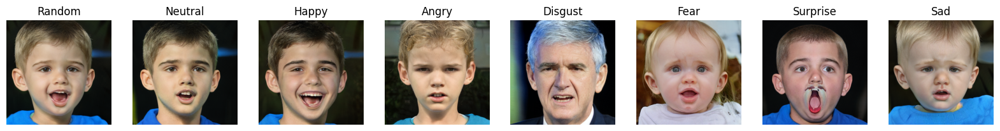
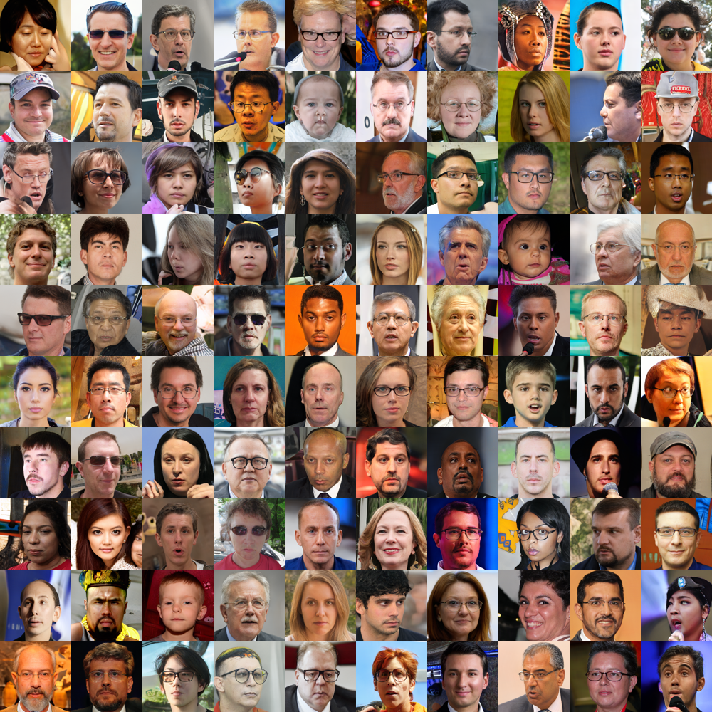

# SmileGAN3

*Generate images with predefined facial expressions.*

## Description

This project leverages the capabilities of [StyleGAN3](https://github.com/NVlabs/stylegan3/tree/main) to generate images, focusing on facial expressions. 


If you don't care how it works, just skip to [Setup](#setup).

## Key Steps

See [main.py](main.py) for further information and to understand all function executions.

### 1. Image Generation with StyleGAN3

- **Objective**: Generate 1000 images using specific input vectors via StyleGAN3.
- **Details**: Utilize StyleGAN3's advanced generative capabilities to create a diverse set of facial images.
- **Results**: Input vectors for the created images are available in [vectors.csv](img/train/vectors.csv).

### 2. Image Labeling

- **Objective**: Manually review the generated images and label each with an appropriate emotion (e.g., angry, sad, etc.).
- **Process**: Careful examination of each image to assign accurate emotional labels.
- **Results**: Labels for the created images are available in [labels.csv](img/train/labels.csv).

### 3. Average Vector Calculation

- **Objective**: Compute the average vector for each emotion based on the labels and corresponding vectors.
- **Usage**: These average vectors are crucial in transforming neutral faces into specific emotional expressions (e.g., adding a smile to a neutral face).
- **Results**: Resulting vectors are available in [model.py](model.py).

### 4. Vector Arithmetic for Image Generation

- **Objective**: Combine random vectors and average emotion vectors to create images with corresponding emotions.
- **Usage & Results**: See [Usage](#usage) and [Results](#results).


## Setup
### 1. Create Virtual Environment:

1. Create venv:
    ```bash
    python3 -m venv venv
    ```

2. Activate venv

    On Windows:
    ```bash
    .\venv\Scripts\activate
    ```

    On Mac and Linux:
    ```bash
    source venv/bin/activate
    ```
3. Install dependencies:

    ```bash
    pip install -r requirements.txt
    ```

4. Deactivate venv (when done generating images)

    ```bash
    deactivate  
    ```

### 2. Add Custom StyleGAN3 Requirements:
1. Clone StyleGAN3 repo:
    ```bash
    git clone https://github.com/NVlabs/stylegan3.git
    ```

2. Copy required packages:
    ```bash
    cp -r stylegan3/torch_utils .
    ```

    ```bash
    cp -r stylegan3/dnnlib .
    ```

3. Remove repo:
    ```bash
    rm -rf stylegan3
    ```

## Usage

We offer to functions to generate images. Example executions can be found in [demo.ipynb](demo.ipynb). 

*Note:* At the first execution the StyleGan3 model will be downloaded, this may take some time.

### Single Image

```python
gen_emotion(emotion, name = None, random_factor=0.25, export=False, visualize=True)
```

The *gen_emotion* function allows users to create a single image for a specified emotion. Available options are: *fear, neutral, disgust, angry, surprised, sad, happy,* and *random*.

For example, *gen_emotion('angry')* generates the following images. 


### Multiple Images 

```python
gen_emotion_row(name, random_factor=0.25, export=False, visualize=True)
```

The *gen_emotion_row* function, generates a random image and applies all emotions to the randomly generated image.



## Results

We created a dataset with 100 happy, sad, etc. images. The results are presented in the following.

### Random


### Angry


### Disgust


### Fear


### Happy


### Neural



### Sad


### Surprise


## Remarks

While the average vectors seem to be able to successfully transfer an emotion on a neutral face there are severable opportunities for improvement.

Fearful and to a lesser degree sad faces appear to be (on average) much younger, while disgusted faces appear to be much older as can be seen in the following image:


This is due to the database of the average vectors, and can be improved using a more extensive database.